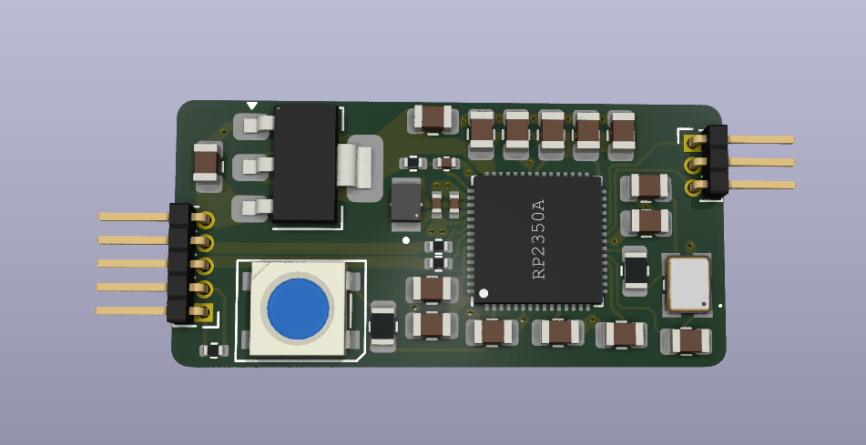

# beacon
*Work in progress*

## Components
### Device
[KiCAD Project](./beacon.kicad)

 
**Development PCB*

### Firmware
[Pico-SDK project](./firmware)

## Attribution
### USB HID
The USB HID implementation is based on various sources:
- https://github.com/hathach/tinyusb
- https://github.com/raspberrypi/pico-examples
- https://github.com/bluekeyes/pico-12vrgb-hid-controller

### SK6812
https://github.com/PDBeal/pico-sk6812

### Icon
<a href="https://www.flaticon.com/free-icons/alarm" title="alarm icons">Alarm icons created by Magnific - Flaticon</a>
